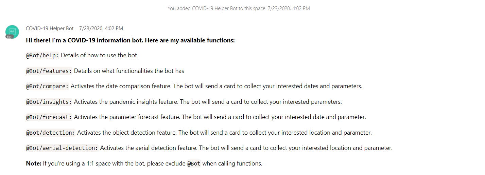
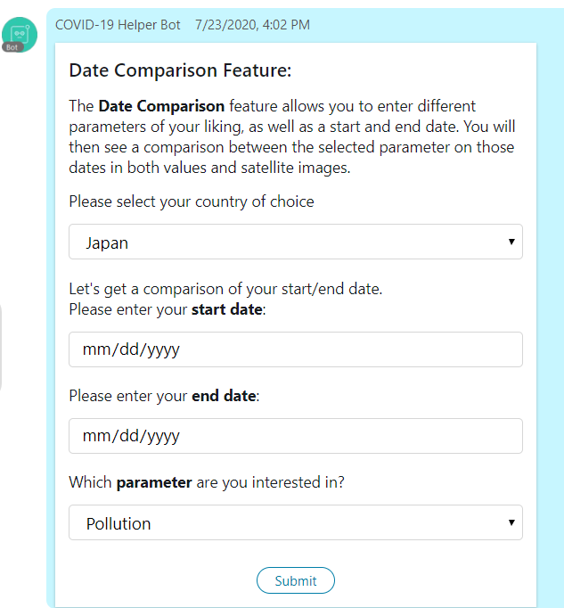
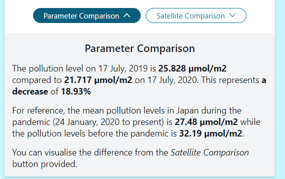
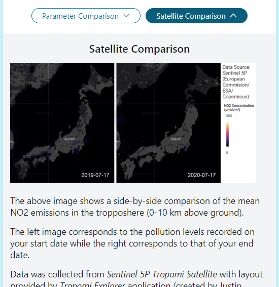

## CiscoCovidBot-Final-
[](https://travis-ci.org/joemccann/dillinger)
This project involves creating a Webex Teams Chatbot that educates and informs the public on COVID-19 related insights. The difference between this project and most others is the fact that this uses satellite level imagery to produce macro-view insights to our users.

## Motivation
Given the impact this recent pandemic has had on our world, we decided to create a chatbot to help both the common public and decision makers alike through the features we have implemented.

## Installation
Install the dependencies and devDependencies and start the server. I'll be using a linux OS but a windows one will work fine with some tweaks as well. The following are items this documentation assumes you already have installed: 
- virtualenv 
- python3 
- [ngrok](https://ngrok.com/download)

### Step 1: Creating a virutal environment
Initialize the virtual environment by running the following commands in your local terminal

```sh
virtualenv venv
source venv/bin/activate
```
### Step 2: Install webexteamssdk
You now have your virtual environment set up. We next need the webexteamssdk module to run the chatbot in python.

```sh
pip install webexteamsssdk
```
### Step 3: Create your bot on Cisco Webex
If you have already created your bot, move on to step 4 with your **access token**. Else, create your Webex Account and create your bot. You will be given an access token. Be sure to save it somewhere safe. We will need it in step 4.

### Step 4: Setup ngrok and env variables
In a different terminal, navigate to the folder where you have the ngrok placed and run the following command.
```sh
ngrok http 5000
```
You should see a url of _https://...ngrok.io_ format. Copy it and export it to the env variables. 
Also, export the port used for ngrok. In this case, we used port 5000. 
```sh
export WEBHOOK_URL=https://...ngrok.io
export PORT=5000
```
Finally, take your bot's access token and place it in your environment variable as WEBEX_TEAMS_ACCESS_TOKEN.

### Step 5: Run the bot
Please read and download the necessary packages if needed from the [requirement.txt](https://github.com/shawnlim97/CiscoCovidBot-Final-/blob/master/requirement.txt) file before proceeding.

We can now run the bot. For this project the bot code is provided under [finalproduct.py](https://github.com/shawnlim97/CiscoCovidBot-Final-/blob/master/Python%20Files/finalproduct.py). 
```sh
python ./finalproduct.py
```
## Webhooks
Webhooks allow users to interact with bots using the ngrok url you previosuly set up. They are many Webhooks available. We will be using three under the "created" event type.
- memberships (created): Allow bot to detect new members (including itself) entering a team space
- messages (created): Allow bot to respond to messages from users/itself
- attachmentActions (created): Allow bot to respond to button press by user on interactive cards 

The point of having a membership webhook is allow the bot to send a help message whenever it is added to a new group or if a new member joins an existing space with the bot in it. This help message will contain keyword commands that will be detected by the bot via the messages webhook whenever users send them. The bot will then respond by replying with interactive cards asking users for their interested parameters (see below). Once users fill these cards and submit them, the bot will use the attachmentActions webhook to sieve out the relevant information desired and send it back to the users. 

Example of help message shown when new member joins a bot space:

## Features!
We will cover the following 3 features here:
* Date Comparison Mode
* Pandemic Insights Mode
* Forecast Mode

The other two features will be covered in another document
### Date Comparison Mode
The date comparison mode is activated using the _/compare_ keyword command with the card as shown



Once submitted, the bot will sieve out the relevant date inputs and extract the corresponding parameter values from the respective csv datasets. It will also sieve out images from the Sat_Images and NDVI_Images folders and get the relevant date-labelled images. The final result will be a parameter value comparison as well as a satellite image comparison.

Example parameter value comparison response:




Example satellite image comparison response:



### Pandemic Insights Mode
The date comparison mode is activated using the _/insights_ keyword command with the card as shown
### Forecast Mode
The date comparison mode is activated using the _/forecast_ keyword command with the card as shown
## Limitations and Future Improvements
