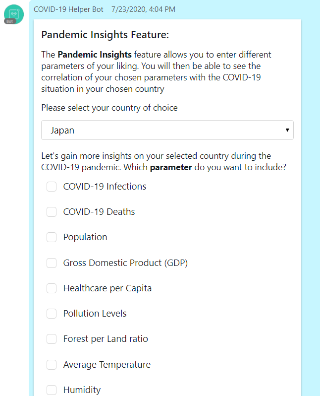
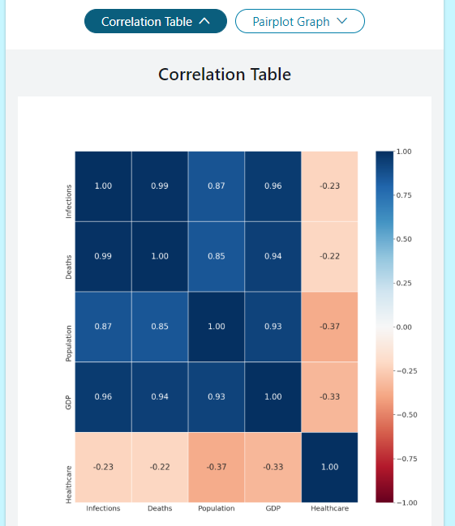
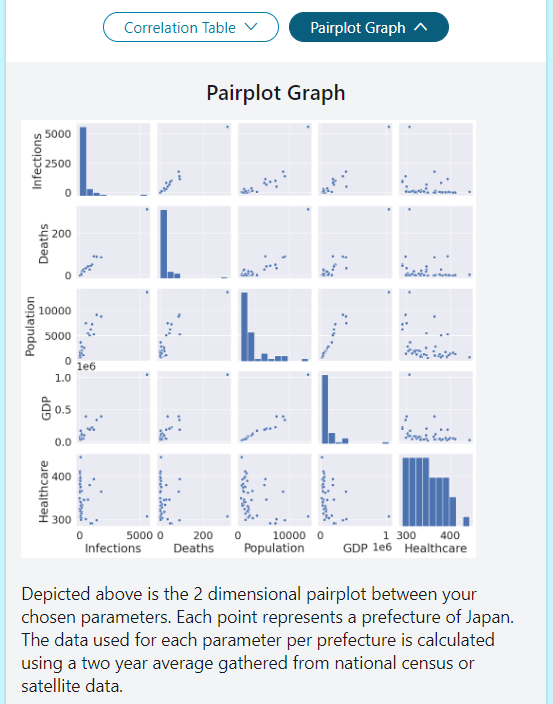
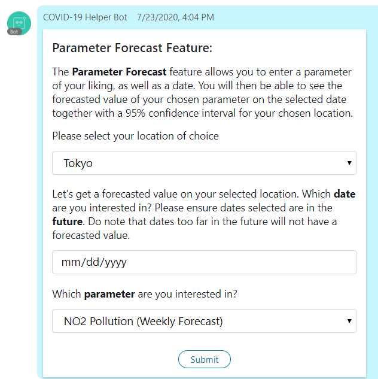
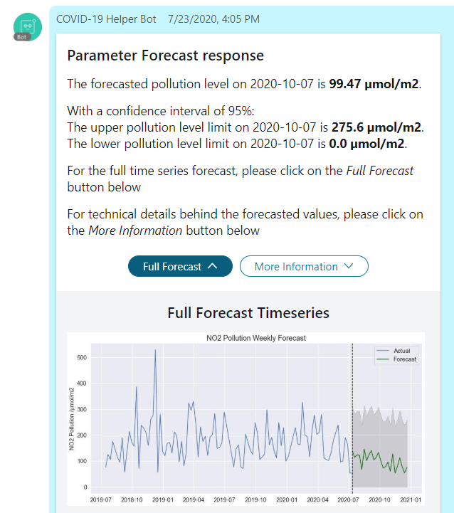
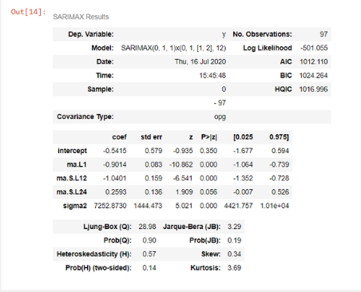
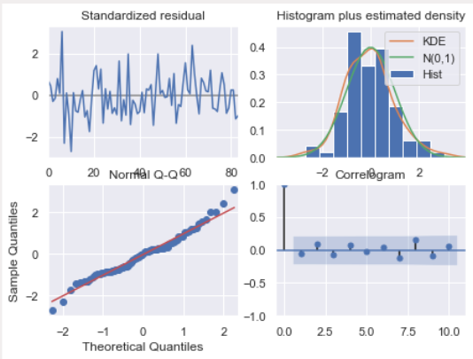
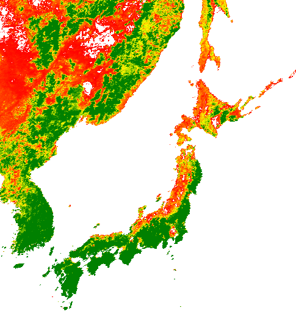

## CiscoCovidBot-Final-
[](https://travis-ci.org/joemccann/dillinger)

This project involves creating a Webex Teams Chatbot that educates and informs the public on COVID-19 related insights. The difference between this project and most others is the fact that this uses satellite level imagery to produce macro-view insights to our users.

## Table of Content
- [Motivation](#motivation)
- [Installation](#installation)
  * [Step 1: Creating a virutal environment](#step-1--creating-a-virutal-environment)
  * [Step 2: Install webexteamssdk](#step-2--install-webexteamssdk)
  * [Step 3: Create your bot on Cisco Webex](#step-3--create-your-bot-on-cisco-webex)
  * [Step 4: Setup ngrok and env variables](#step-4--setup-ngrok-and-env-variables)
  * [Step 5: Run the bot](#step-5--run-the-bot)
- [Webhooks](#webhooks)
- [Features!](#features-)
  * [Date Comparison Mode](#date-comparison-mode)
  * [Pandemic Insights Mode](#pandemic-insights-mode)
  * [Forecast Mode](#forecast-mode)
- [Limitations and Future Improvements](#limitations-and-future-improvements)
  * [Real-time data](#real-time-data)
  * [Real-time images](#real-time-images)

<small><i><a href='http://ecotrust-canada.github.io/markdown-toc/'>Table of contents generated with markdown-toc</a></i></small>


## Motivation
Given the impact this recent pandemic has had on our world, we decided to create a chatbot to help both the common public and decision makers alike through the features we have implemented.

## Installation
Install the dependencies and devDependencies and start the server. I'll be using a linux OS but a windows one will work fine with some tweaks as well. The following are items this documentation assumes you already have installed: 
- virtualenv 
- python3 
- [ngrok](https://ngrok.com/download)

### Step 1: Creating a virtual environment
Initialize the virtual environment by running the following commands in your local terminal

```sh
virtualenv venv
source venv/bin/activate
```
### Step 2: Install webexteamssdk
You now have your virtual environment set up. We next need the webexteamssdk module to run the chatbot in python.

```sh
pip install webexteamsssdk
```
### Step 3: Create your bot on Cisco Webex
If you have already created your bot, move on to step 4 with your **access token**. Else, create your Webex Account and create your bot. You will be given an access token. Be sure to save it somewhere safe. We will need it in step 4.

### Step 4: Setup ngrok and env variables
In a different terminal, navigate to the folder where you have the ngrok placed and run the following command.
```sh
ngrok http 5000
```
You should see a url of _https://...ngrok.io_ format. Copy it and export it to the env variables. 
Also, export the port used for ngrok. In this case, we used port 5000. 
```sh
export WEBHOOK_URL=https://...ngrok.io
export PORT=5000
```
Finally, take your bot's access token and place it in your environment variable as WEBEX_TEAMS_ACCESS_TOKEN.

### Step 5: Run the bot
Please read and download the necessary packages if needed from [requirement.txt](https://github.com/shawnlim97/CiscoCovidBot-Final-/blob/master/requirement.txt) file and the [Downloads](https://github.com/shawnlim97/CiscoCovidBot-Final-/tree/master/Downloads) folder before proceeding. 

We can now run the bot. For this project, the bot code is provided under [finalproduct.py](https://github.com/shawnlim97/CiscoCovidBot-Final-/blob/master/Python%20Files/finalproduct.py). Please also be mindful to change the directory in the code to your own local paths.
```sh
python ./finalproduct.py
```
## Webhooks
Webhooks allow users to interact with bots using the ngrok url you previosuly set up. They are many Webhooks available. We will be using three under the "created" event type.
- memberships (created): Allow bot to detect new members (including itself) entering a team space
- messages (created): Allow bot to respond to messages from users/itself
- attachmentActions (created): Allow bot to respond to button press by user on interactive cards 

The point of having a membership webhook is allow the bot to send a help message whenever it is added to a new group or if a new member joins an existing space with the bot in it. This help message will contain keyword commands that will be detected by the bot via the messages webhook whenever users send them. The bot will then respond by replying with interactive cards asking users for their interested parameters (see below). Once users fill these cards and submit them, the bot will use the attachmentActions webhook to sieve out the relevant information desired and send it back to the users. 

Example of help message shown when new member joins a bot space:

## Features!
We will cover the following 3 features here:
* Date Comparison Mode
* Pandemic Insights Mode
* Forecast Mode

The other two features will be covered [here](https://github.com/chensxb97/object_detection_chatbot.git)
### Date Comparison Mode
The date comparison mode is activated using the _/compare_ keyword command with the card as shown


Once submitted, the bot will sieve out the relevant date inputs and extract the corresponding parameter values from the respective [csv datasets](https://github.com/shawnlim97/CiscoCovidBot-Final-/tree/master/Downloads). It will also sieve out images from the [Sat_Images](https://github.com/shawnlim97/CiscoCovidBot-Final-/tree/master/Sat_Images) and [NDVI_Images](https://github.com/shawnlim97/CiscoCovidBot-Final-/tree/master/NDVI_Images) folders and get the relevant date-labelled images. The final result will be a parameter value comparison as well as a satellite image comparison.

Example parameter value comparison response:


Example satellite image comparison response:


### Pandemic Insights Mode
The date comparison mode is activated using the _/insights_ keyword command with the card as shown (submit button out of frame)



Once submitted, the bot will compile the users' interested paramters and perform a correlation study on each one of them. It will produce a correlation heatmap and pariplot graph for the users' perusal.

Example correlation heatmap response:




Example pairplot graph response:



### Forecast Mode
The date comparison mode is activated using the _/forecast_ keyword command with the card as shown



Once submitted, the bot will sieve out the future date entered by the user and extract the corresponding value from the respective csv datasets. It will also show the full forecasted time series projected by the model.



The model used for the NDVI parameter was FB prophet. A Fourier order of 10 was used to model seasonal changes together with two additional regressors. Location-based holidays was also added to the model to account for irregular schedules in the dataset. A monthly basis forecast is used to better highlight seasonal differences.

The model used for the Pollution parameter was SARIMA. Auto-arima was used to determine parameters that yield the least error model. A plot diagnostic was also done to ensure residual errors were within an acceptable bias and autocorrelation. A weekly basis forecast is used as the pollution dataset is only available over a 2 year period. 

Model determined using auto-arima:




Plot diagnostics of model used:



For more information, please refer to [this link](https://github.com/renelikestacos/Google-Earth-Engine-Python-Examples/blob/master/007_EE_Time-Series_Prediction_and_Forecast.ipynb)

## Limitations and Future Improvements
Due to the shortage of time, the current bot is not programmed to carry real time information. This is however possible using the Google Earth Engine Python API.
### Real-time data
After [initialising and authenticating GEE on Python](https://developers.google.com/earth-engine/python_install), select your location of interest as well as the satellite you are interested in.
```sh
# Set start and end date
startTime = datetime.datetime(2018, 1, 1)
endTime = datetime.datetime(2021, 1, 1)
# Create image collection
probav = ee.ImageCollection('MODIS/006/MOD13A2').filterDate(startTime, endTime)
point = ee.Geometry.Point([139.6503,35.6762]) #location: Tokyo
info_probav = probav.getRegion(point, 50).getInfo()
```
This will give the raw information the satellite has collected from January 1st, 2018 to the present day. It's still very messy with many numbers and features you might not interested in. To rectify and clean this data, run the following code. Suppose we are interested in the NDVI feature:
```sh
header = info_probav[0]
data = array(info_probav[1:])
iTime = header.index('time')
time = [datetime.datetime.fromtimestamp(i/1000) for i in (data[0:,iTime].astype(int64))]

band_list=['NDVI']
iBands = [header.index(b) for b in band_list]
ndvi = data[0:,iBands].astype(np.float)

df = pd.DataFrame(data=ndvi, index=time, columns=['ndvi'])
probav_time_series = df.dropna()
```
This will give you a nice two column dataframe with index as datetime and ndvi as your real-time data. The chatbot can then be programmed to extract users' dates as per normal. 
### Real-time images
This is a little trickier. Since Webex Teams doesn't support Map files, our next best alternative is to use static images. While not an issue for the default code editor, using GEE Python API to do this requires you to manually set a Web Mercator projection on the static map you desire. Otherwise, a native image will be shown (a globe and not a flat map). In addition, geodesic has to be set to False for your geometry to work normally.
```sh
dem = ee.Image('MODIS/006/MOD13A2/2018_01_17').select('NDVI')
AOI = ee.Geometry.Rectangle([125,30, 150, 50], geodesic=False, proj=None)

Image(url = dem.updateMask(dem.gt(0)).setDefaultProjection('EPSG:3857', [1, 0, 0, 0, -1, 0])
      .getThumbURL({'min': 0, 'max': 3000, 'dimensions': 512, 'palette': ['red', 'yellow', 'green'], 'region': AOI,
                }))
```
Running this code will yield you the following image dated 17 January, 2018. For this to be in real-time, simply change the date id to the present day image (note: NDVI is recorded once every 16 days so not everyday would have an NDVI image). 


